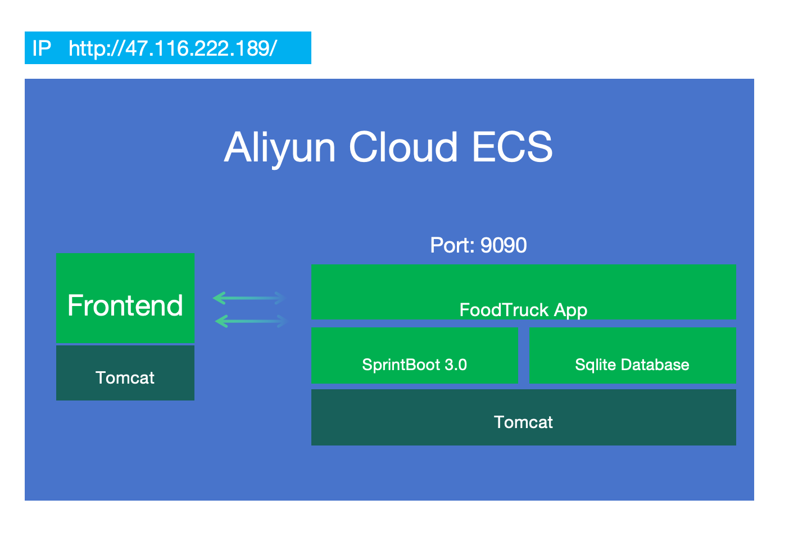

# Introduction

## This project is for engineering accessment for food truck demo. The project designed for a online food delivery system:

1. user open the web at http://47.116.222.189/, 
2. input food you want(like Chicken), then clicke search button
3. the system will return the food truck that sell the food, and the vendor list information
4. user can click the vendor list to see the detail information of the vendor
5. user click "order", then they can order the food from the vendor, that's all :)
6. This is just several hours work, so it is far more from perfect

## On the Backend:
1. backend is write by java 17, on OpenJDK 21, spring boot 3.x, and sqlite database for simple. Also supplied a unit test  project for the backend, at src/test/java folder, it is based on Spring Boot Test framework
2. the whole site http://47.116.222.189/ deployed on a cloud server, Aliyun ECS
3. clone the source code with git ,open the folder with VS code to compile, add "Extension Pack For Java", "Test Runner For Java" as VS code extension to compile java.
4. The truck food info in CSV is inserted to sql lite database already
5. sql.sql is to create the  db table schema,  InsertTable.java is the file to flush the sql lite db .

## On the Frontend:
1. frontend is just native js/html/css, no framework used for simple development
2. donwload the source code, open with VS code to compile, put the folder to a web server, then you can see the page
3. also supplied a dock file ,you can build to deploy to k8s

## Arckitecture:

